<div align="center">

# 🕌 GO INDIA

### *Discover the Incredible Beauty & Cultural Richness of India*


[](https://gooindia.netlify.app/)
[](https://github.com/koushik4475/gooindia/stargazers)
[](LICENSE)
[](https://github.com/koushik4475/gooindia/pulls)

<br>

### 🎥 **LIVE PREVIEW**

<a href="https://gooindia.netlify.app/" target="_blank">
  
</a>

<br>

**👆 Click the image above to explore the live website! 👆**


</div>

---

## 🎬 **Live Preview**

<div align="center">

### 🌐 **[CLICK HERE TO VIEW LIVE DEMO](https://gooindia.netlify.app/)** 🌐

<a href="https://gooindia.netlify.app/" target="_blank">
  
</a>

<br><br>

### **✨ Experience the Magic**

<table>
<tr>
<td width="50%">

#### 🎭 **Interactive Animations**
- Smooth scroll effects
- Particle system background
- Hover transformations
- Gradient text animations

</td>
<td width="50%">

#### 🎨 **Visual Features**
- Modern dark theme
- Responsive grid layouts
- Dynamic navigation
- Parallax backgrounds

</td>
</tr>
</table>


### 📱 **Responsive Preview**

<table>
<tr>
<td align="center" width="33%">
  <br>
  <b>Desktop</b><br>
  Full-screen experience<br>
  ✅ Optimized
</td>
<td align="center" width="33%">
  <br>
  <b>Tablet</b><br>
  Touch-friendly interface<br>
  ✅ Optimized
</td>
<td align="center" width="33%">
  <br>
  <b>Mobile</b><br>
  Swipe navigation<br>
  ✅ Optimized
</td>
</tr>
</table>

</div>

---

## 🌟 **Project Showcase**

<div align="center">

### 🎭 **Hero Section - Gateway to India**


<details>
<summary>📸 <b>View More Screenshots</b></summary>

<br>

### 📖 **About Section**


### 🏛️ **Popular Destinations**


### 🗺️ **Explore & Testimonials**


### 📬 **Newsletter Subscription**


### 👨‍💻 **Developer Profile**


</details>


</div>

---

## ✨ **Key Features**

<div align="center">

| Feature | Description |
|---------|-------------|
| 🎨 **Modern UI/UX** | Dark theme with vibrant gradients & smooth animations |
| ✨ **Particle System** | Canvas-based dynamic particle effects |
| 📱 **Responsive Design** | Seamless experience across all devices |
| 🎭 **Rich Animations** | Scroll-triggered fade-ins, hover effects & transformations |
| 🧭 **Smart Navigation** | Active link highlighting with smooth scrolling |
| 🔝 **Scroll to Top** | Elegant floating button with smooth transitions |
| 🌍 **7+ Destinations** | Curated showcase of India's iconic locations |
| 💬 **Testimonials** | Real traveler experiences & reviews |
| 📧 **Newsletter** | Stay updated with travel tips & deals |

</div>

---

## 🎯 **Featured Destinations**

```mermaid
%%{init: {'theme':'base', 'themeVariables': { 'primaryColor':'#FF6B35','primaryTextColor':'#ffffff','primaryBorderColor':'#FF8C00','lineColor':'#FFD700','secondaryColor':'#4CAF50','secondaryTextColor':'#ffffff','secondaryBorderColor':'#45a049','tertiaryColor':'#2196F3','tertiaryTextColor':'#ffffff','tertiaryBorderColor':'#1976D2','noteBkgColor':'#FF6B35','noteTextColor':'#ffffff','background':'#1a1a2e','mainBkg':'#FF6B35','nodeBorder':'#FFD700'}}}%%
mindmap
  root((🇮🇳 INDIA))
    🏰 Historical
      Mysore Palace
      Statue of Unity
      Gumbaz
    🏔️ Natural
      Himalayan Mountains
      Jog Falls
      Sikkim Lake
    🏖️ Coastal
      Beaches
      Tropical Paradise
```

<div align="center">



</div>

---

## 🛠️ **Tech Stack**

<div align="center">


### **Libraries & Resources**


</div>

---

## 🚀 **Quick Start**

<div align="center">

```bash
# 📥 Clone the repository
git clone https://github.com/koushik4475/gooindia.git

# 📂 Navigate to directory
cd gooindia

# 🌐 Open in browser
# Simply open index.html or use a local server
```

</div>

### **Local Server Options**

<details>
<summary><b>Click to expand server commands</b></summary>

```bash
# Using Python
python -m http.server 8000

# Using Node.js
npx http-server

# Using PHP
php -S localhost:8000

# Using Live Server (VS Code Extension)
# Right-click index.html → Open with Live Server
```

</details>

---

## 📁 **Project Structure**

```bash
gooindia/
│
├── 📄 index.html                 # Main HTML file with embedded CSS & JS
├── 📁 assets/
│   └── 📁 img/                  # Image assets
│       ├── 🏠 home_bg.jpg
│       ├── 🕌 home_mysore-palace.jpg
│       ├── 💧 home_jog-fall.jpg
│       ├── 🗿 home_unity-statue.jpg
│       ├── ⛰️ home_mountain.jpg
│       ├── 🏖️ home_beach.jpg
│       ├── 🕌 gumbazz.jpg
│       ├── 🏞️ home_lake.jpg
│       ├── 🏛️ about_mysore.jpg
│       ├── 🌊 explore_beach.jpg
│       ├── 👤 my_profile.jpg
│       └── 📸 p1.jpg, p2.jpg, p3.jpg
│
└── 📄 README.md                 # Documentation
```

---

## 🎨 **Design System**

<div align="center">

### **Color Palette**

| Color | Hex Code | Usage |
|-------|----------|-------|
| 🖤 **Pure Black** | `#000000` | Background |
| ⚫ **Dark Gray** | `#141414` | Container |
| ⚪ **White** | `#FFFFFF` | Titles |
| 🌫️ **Light Gray** | `#B3B3B3` | Text |
| 🔥 **Vibrant Orange** | `#FF6B35` | Accents & CTAs |

### **Typography**


</div>

---

## 📱 **Responsive Design**

<div align="center">

| Device | Breakpoint | Status |
|--------|-----------|--------|
| 🖥️ Desktop | > 768px | ✅ Optimized |
| 📱 Tablet | 768px | ✅ Optimized |
| 📱 Mobile | < 768px | ✅ Optimized |

</div>

---

## ⚡ **Performance Optimizations**

```mermaid
graph LR
    A[🎯 Optimizations] --> B[⚡ Hardware Acceleration]
    A --> C[🔄 RequestAnimationFrame]
    A --> D[👁️ Intersection Observer]
    A --> E[🖼️ Optimized Images]
    A --> F[📦 Minimal Dependencies]
    
    style A fill:#FF6B35,stroke:#fff,stroke-width:2px,color:#fff
    style B fill:#00C853,stroke:#fff,stroke-width:2px,color:#fff
    style C fill:#00C853,stroke:#fff,stroke-width:2px,color:#fff
    style D fill:#00C853,stroke:#fff,stroke-width:2px,color:#fff
    style E fill:#00C853,stroke:#fff,stroke-width:2px,color:#fff
    style F fill:#00C853,stroke:#fff,stroke-width:2px,color:#fff
```

<div align="center">



</div>

---

## 🤝 **Contributing**

<div align="center">

We love contributions! 🎉


### **How to Contribute**

</div>

1. 🍴 **Fork** the repository
2. 🌿 Create your feature branch
   ```bash
   git checkout -b feature/AmazingFeature
   ```
3. 💾 **Commit** your changes
   ```bash
   git commit -m '✨ Add some AmazingFeature'
   ```
4. 📤 **Push** to the branch
   ```bash
   git push origin feature/AmazingFeature
   ```
5. 🎯 Open a **Pull Request**

---

## 👨‍💻 **Developer**

<div align="center">


### **Koushik HY**

🎓 Computer Science & Design | Mysore University  
💼 Full Stack Developer  
🌐 Web & Mobile Application Specialist  
💻 HTML • CSS • JavaScript Expert

<br>

### **Let's Connect!**

[](mailto:koushik.h.y44@gmail.com)
[](https://github.com/koushik4475)
[](https://www.facebook.com/profile.php?id=100016214017234&mibextid=ZbWKwL)
[](https://instagram.com/hy_koushik?igshid=MzMyNGUyNmU2YQ==)
[](https://chat.whatsapp.com/BahfvMnNJy23oZmqvpgRA0)

<br>

📍 **Available for Freelance Projects**

</div>

---

## 🗺️ **Roadmap**

<div align="center">


</div>

### **Upcoming Features** 

- [ ] 🎫 Booking functionality
- [ ] 🔌 Travel API integration
- [ ] 🗺️ 20+ new destinations
- [ ] 🌓 Dark/Light theme toggle
- [ ] 📝 Travel blog section
- [ ] 🌐 Multi-language support (Hindi, English, Regional)
- [ ] 🎥 360° virtual tours
- [ ] ☁️ Real-time weather information
- [ ] 🎟️ Local event calendars
- [ ] 🍛 Cuisine recommendations

---

## 📄 **License**

<div align="center">

This project is licensed under the **MIT License** - see the [LICENSE](LICENSE) file for details.

```
MIT License - Free to use, modify, and distribute
```

</div>

---

## 🙏 **Acknowledgments**

<div align="center">

- 📸 **Photography** - Stunning travel photography collections
- 🎨 **Icons** - [Remix Icon](https://remixicon.com/) library
- 🔤 **Fonts** - [Google Fonts](https://fonts.google.com/) (Montserrat & Poppins)
- 💡 **Inspiration** - Modern travel websites & Indian tourism boards

</div>

---

## 📈 **Support the Project**

<div align="center">


### **If you found this project helpful, please consider:**

⭐ **Starring** the repository  
🔄 **Sharing** with fellow developers  
🐛 **Reporting** issues  
💡 **Suggesting** new features  
🤝 **Contributing** to the code

<br>

[](https://github.com/koushik4475)
[](https://github.com/koushik4475/gooindia/fork)
[](https://github.com/koushik4475/gooindia)

</div>

---

<div align="center">


### **Made with ❤️ and ☕ by Koushik HY**


</div>
